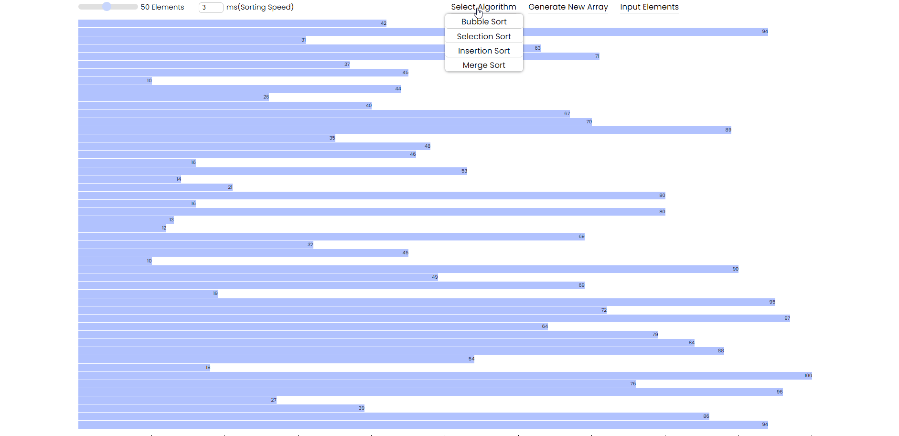
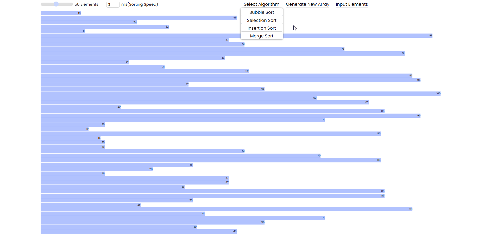
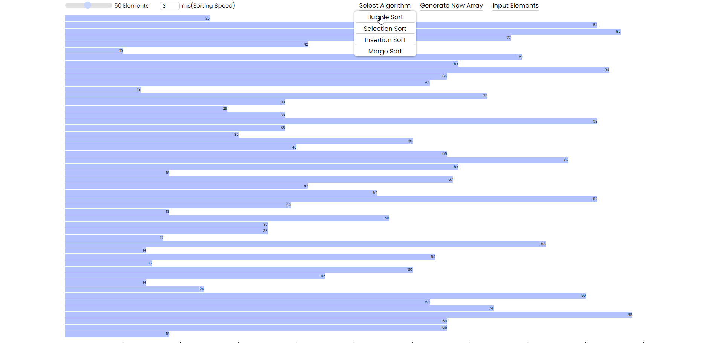
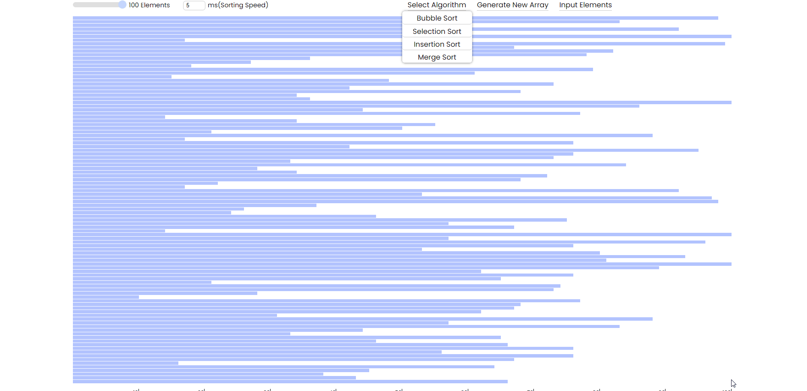
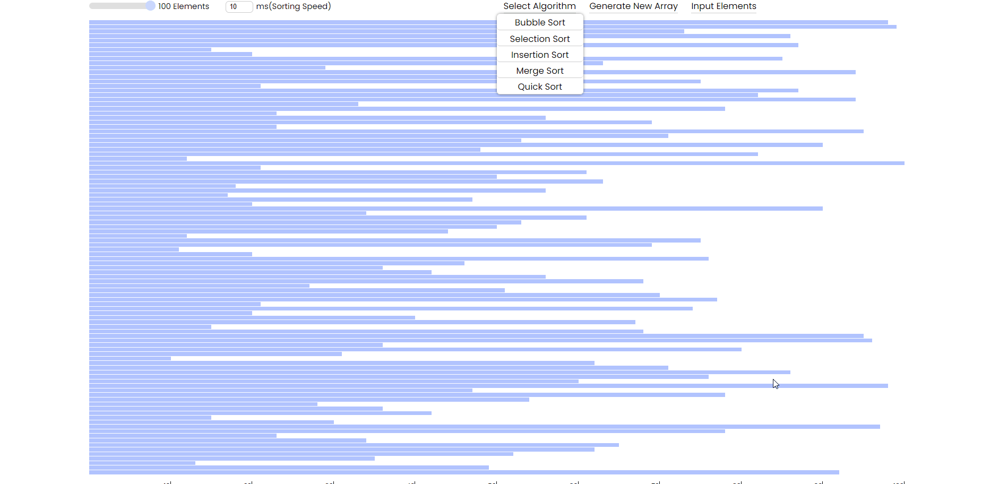
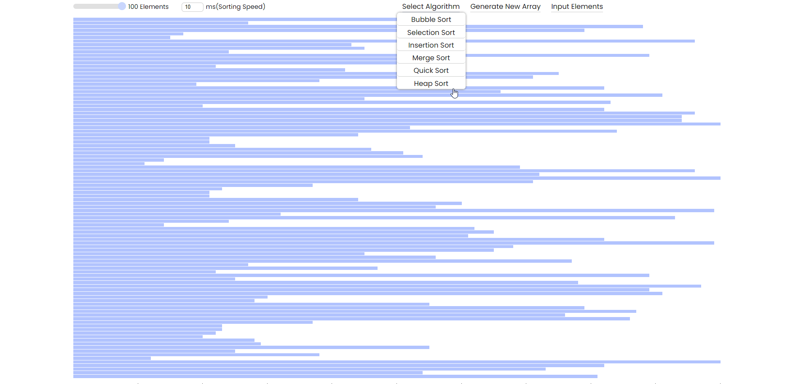
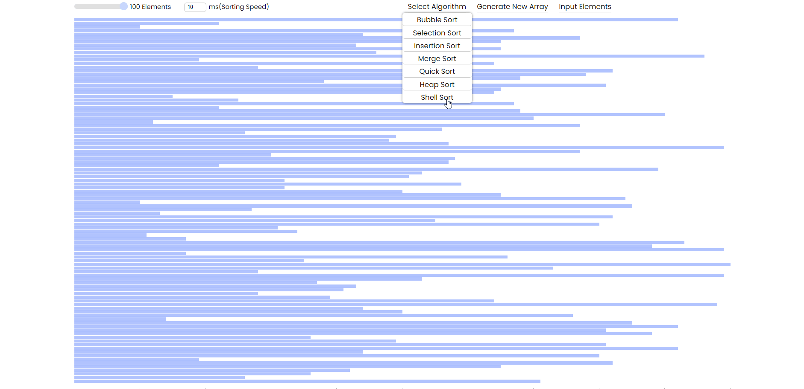
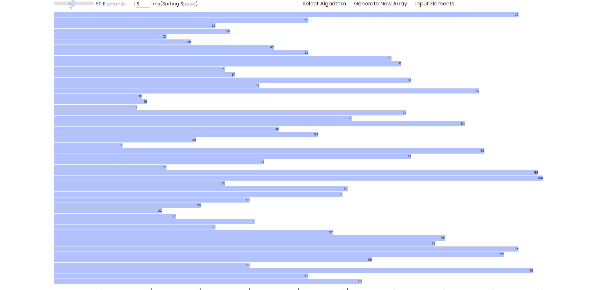

# SORTING VISUALIZER

> This is a react application which visualizes some array sorting algorithms


## Modules and dependencies
**In the root folder of your project**
```console
    npx create-react-app .
    npm install react-modal
```

## BUBBLE SORT
_Elements - 50_ <br/>
_Sorting Speed - 3ms_


---

## SELECTION SORT
_Elements - 50_ <br/>
_Sorting Speed - 3ms_


---

## INSERTION SORT
_Elements - 50_ <br/>
_Sorting Speed - 3ms_


---

## MERGE SORT
_Elements - 100_ <br/>
_Sorting Speed - 5ms_


---

## QUICK SORT
_Elements - 100_ <br/>
_Sorting Speed - 10ms_


---

## HEAP SORT
_Elements - 100_ <br/>
_Sorting Speed - 10ms_


---

## SHELL SORT
_Elements - 100_ <br/>
_Sorting Speed - 10ms_


---

<br/>

**Height of the bars changes with the change in number of elements**


<br/>

**Input elements**
